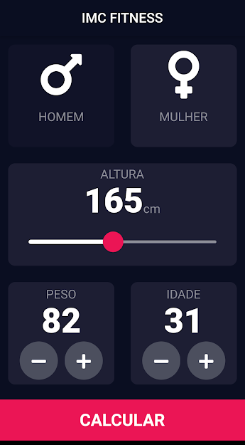
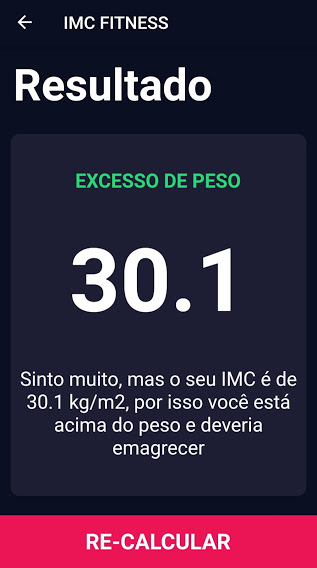

 

# imc_calculadora

IMC Calculadora é um aplicativo desenvolvido na linguagem de programação Dart usando o framework Flutter.

Desenvolvido por:
Cleberson Gilvan.

Aplicando os estudos do curso: 
Complete Flutter App Development Bootcamp with Dart - Dr. Angela Yu

## Getting Started

 

